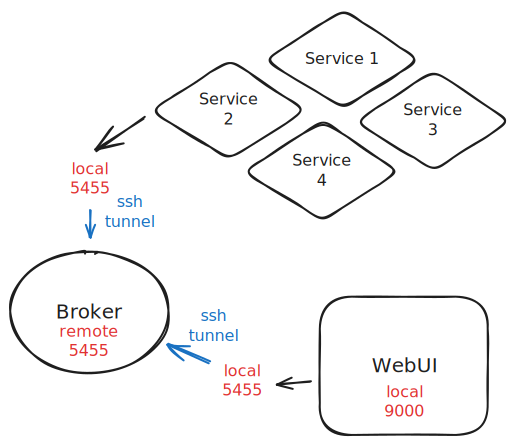

# PyWorkMan
Distributed job scheduling and workload management via a web interface.

## Installation
```sh
pip install git+https://github.com/akhlakm/pyworkman.git
```

To update, run
```sh
workman update
```

### Broker
The message broker (`mgr`) should be setup as a long running process in a easily accessible server. Message passed between the broker, ui and workers will be end-to-end encrypted.

```sh
# Create YAML config file, set the mgr_url (default 5455).
workman

# Start the broker.
workman mgr

# View the generated key file.
cat mgr.key
```

The broker will generate key file, which must be copied to other machines for the UI and service workers. Improperly encrypted messages will be silently ignored.

### WebUI
The webUI (`ui`) should be run on the local workstation/laptop where you can open up a web browser.

```sh
# Install webui dependencies.
pip install .[ui]

# Create a SSH tunnel to the broker port (default 5455 -> 5455).
workman tunnel

# Create YAML config file, update the mgr_url to the local port.
workman

# Copy or manually create the key file with VSCode. Do not use VIM.
rsync user@remote:/path/to/mgr.key mgr.key

# Run the web ui.
workman ui
```

### Services
Service workers can be run on any machine. Each service can have many workers.
```sh
# Create a SSH tunnel to the broker port (default 5455 -> 5455).
workman tunnel

# Copy or manually create the key file with VSCode. Do not use VIM.
rsync user@remote:/path/to/mgr.key mgr.key

# Create config-svc.yaml file.
# Use mgr_url pointing to the local port.
```

Overview of the connections and ports. First create the SSH tunnel from local ports to the broker then use the local connections.



## How to write a service
```python
from workman.worker import start_worker

class EchoService:
    """ A simple echo example. """

    # define the inputs as class properties.
    message : str = \
        dict(help="Message to send.", default="hello", required=1)
    
    reverse : bool = \
        dict(help="Reverse the message.", default=False)


    @staticmethod
    def run(send, job : 'EchoService') -> str:
        # process the inputs.
        send.update("Input: " + job.message)

        if job.reverse:
            return job.message[::-1]
        else:
            return job.message

start_worker(EchoService, "http://localhost:5455", "mgr.key")
```

Run `workman copy echo` to copy this example script to the current directory. See more examples in `workman/examples`.
